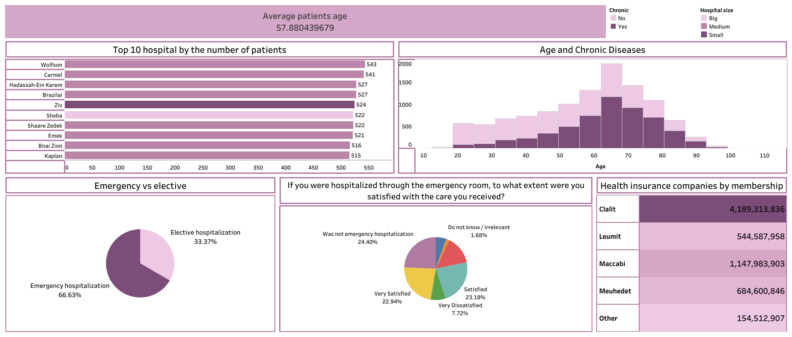

# Data cleaning in python and visualization in Tableau

Cleaning hospital dataset in python and then making visualization in Tableau.

In this project we use the data from -> https://data.gov.il/dataset/satisfaction-hosp-general2016 which includes information from Israel's hospitals in 2016. 

Link to dashboard : https://public.tableau.com/app/profile/meliha.pa.i.dzafi./viz/Hospital_data_visualization/Dashboard1

